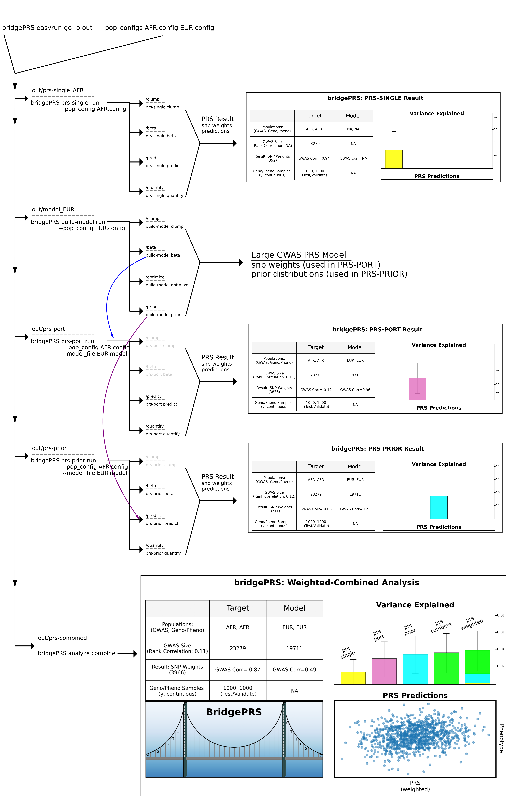

 

# Subprograms 

BridgePRS consists of five related multi-function subprograms: 

1) **BridgePRS prs-single**  
2) **BridgePRS build-model**  
3) **BridgePRS prs-port**    
4) **BridgePRS prs-prior**   
5) **BridgePRS analyze combine**

|Subprogram|Input|Subcommands|Output|
|:-:|:-:|:-:|:-:|
|**prs-single**|Target Pop Data|**run**,clump,beta,predict,quantify|prs-result| 
|**build-model**|Model Pop Data|**run**clump,beta,optimize,prior|model-params| 
|**prs-port**|Target Pop + Model Result|**run**,predict,quantify|prs-result| 
|**prs-prior**|Target Pop Data|**run**,clump,beta,test,predict|prs-result| 
|**analyze**|PRS Result Files|**run**result,combine|single-plot,weighted prs-result,weighted prs plot| 

These programs can be called consecutively using the easyrun master-program 
which will create the following directory structure: 

##prs-single 

The subprogram (**prs-single**) and subcommand (**run**) (`./bridgePRS prs-single run`) requires that the 
following target population data be provided on the command line or inside of a configuration file: 

1. **--pop:** The name of your target population 
2. **--ldpop:** The ld reference name, if different from target population name 
3. **--sumstats_prefix:** The path to GWAS data 
4. **--genotype_prefix:** Path to target genotype data 
5. **--phenotype_files:** Two target phenotype files (test and validate) 

##build-model

The subprogram 

##prs-port 

The subprogram 

##prs-prior 

The subprogram 

##analyze

The subprogram 

