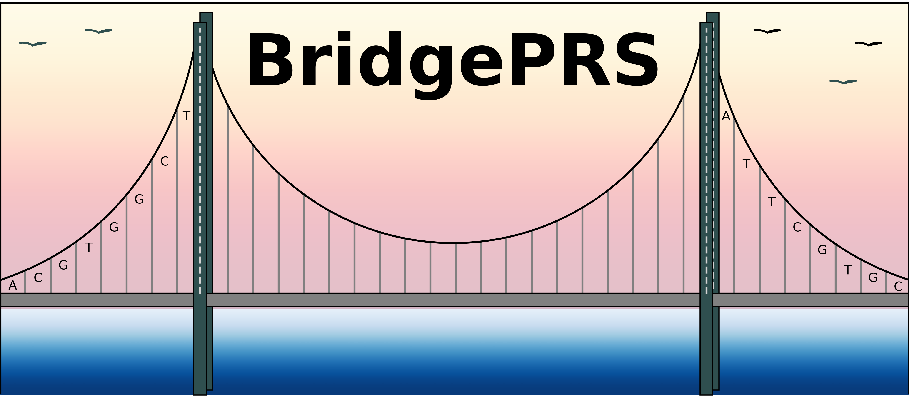
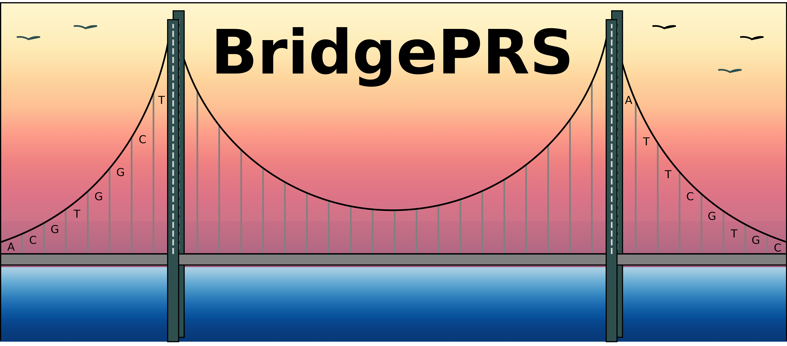
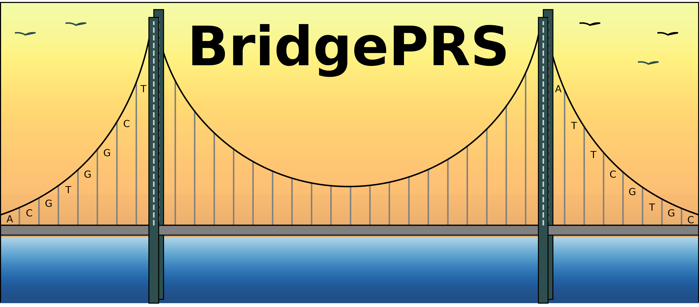

[//]: # ( 
[//]: # (
 
 

[//]: # ( 

BridgePRS is a Bayesian-ridge (Bridge) approach, which "bridges" the PRS between two populations of different ancestries, developed to tackle the PRS portability problem that results in underrepresented ancestry population having inaccurate PRS due to the bias towards European ancestry in GWAS data collection. 

# Package Downloads 
| Operating System | Link |
| -----------------|:----:|
| Linux  64-bit | [v2.3.3](https://github.com/clivehoggart/BridgePRS/archive/refs/heads/main.zip) |
| Mac  64-bit   | [v2.3.3](https://github.com/clivehoggart/BridgePRS/archive/refs/heads/main.zip) |
| Windows   | Not available |

!!! Note "Latest Updates"
    # 2023-09-15 (v0.1.7)
    - We have added sample thousand genomes data. 
    - update log can be found [here](misc_log.md)

# Quick Start
- Get started right away using sample data with our [Quick Start Tutorial!](quikstart_prep.md).
- Completing the tutorial and [training](quikstart_training.md) is often sufficient to begin using BridgePRS!

# Information 
- BridgePRS is a software package written in R (main) and Python (wrapper) that depends on Plink (by [Christopher Chang](https://www.cog-genomics.org/software)). 
  For more information on installing dependencies, please refer to [Requirements](guide_requirements.md). 
- To learn more about BridgePRS see our complete [Guide.](guide_background.md)

!!! Caution "Citation: Our Manuscript is in press at [Nature Genetics](yo)"  
    Please cite our [preprint](https://pubmed.ncbi.nlm.nih.gov/36865148/):
    
    Hoggart C, Choi SW, García-González J, Souaiaia T, Preuss M, O'Reilly P. BridgePRS : A powerful trans-ancestry Polygenic Risk Score method.
    bioRxiv (2023). doi: 10.1101/2023.02.17.528938. 

## Contact 
For questions about the methodology, this website, or our manuscript please contact [Dr Clive Hoggart](http://www.pauloreilly.info/), 
[Dr Tade Souaiaia](http://www.pauloreilly.info/), or [Dr Paul O'Reilly](http://www.pauloreilly.info/). 

## Issues 

This wiki should cover basic usage for BridgePRS. 
If you have problems, please feel free to submit an issues [here](https://github.com/tadesouaiaia/BridgePRS-guide/issues) or visit our [google group](https://groups.google.com/forum/#!forum/bridgePRS).

## Acknowledgements

We would like to thank Brian Fulton-Howard for his expert programming advice. 

