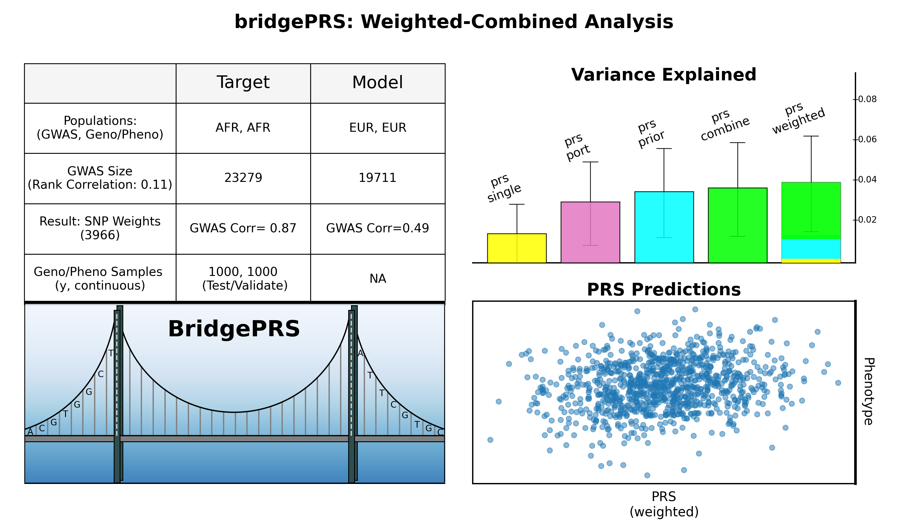

## 1) Continuous Trait [ "y" ] 

!!! tips "Easyrun Command" 
    After installing and verfying the [requirements](quikstart_prep.md), run BridgePRS on the toy phenotype "y" with the following command: 
        ```
        $./bridgePRS easyrun go -o out1 --pop_configs data/afr.config data/eur.config --phenotype y 
        ```

A summary figure will be created in `out1/AFR_summary.png`: 




## 2) Binary Trait [ "y.binary" ] 

!!! tips "Easyrun Command" 
    Run BridgePRS on the toy binary phenotype "y.binary" with the following command: 
        ```
        $./bridgePRS easyrun go -o out2 --pop_configs data/afr.config data/eur.config --phenotype y.binary
        ```

A summary figure will be created in `out2/AFR_summary.png`: 
    


